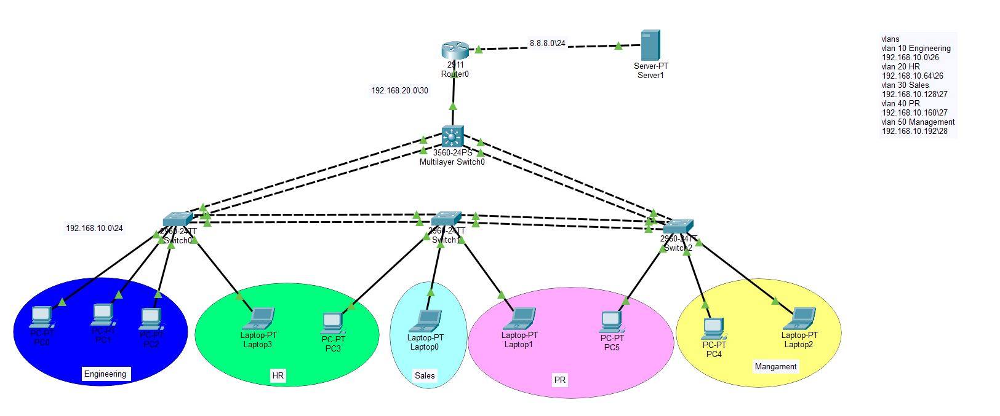

# Comprehensive Campus Switching Network Design

## Description
This repository contains a comprehensive enterprise network topology focused heavily on advanced switching concepts, Layer 2 security, and Inter-VLAN routing. I designed this entire network architecture from scratch to meet specific organizational requirements, utilizing Cisco Packet Tracer for simulation and verification. The core objective was to build a highly available, secure, and logically segmented campus network.

## Project Requirements
The organization required a highly secure and segmented network utilizing the `192.168.10.0/24` base IP block[cite: 1]. I was tasked with designing a topology to accommodate the following departments and their specific host capacities:
*   **VLAN 10 (Engineering):** Requires support for 60 clients[cite: 1].
*   **VLAN 20 (HR):** Requires support for 50 clients[cite: 1].
*   **VLAN 30 (Sales):** Requires support for 30 clients[cite: 1].
*   **VLAN 40 (PR / Guest / IoT):** Requires support for 20 clients[cite: 1].
*   **VLAN 50 (Management):** Requires support for 14 clients[cite: 1].
*   **External Network:** A connection to an external DNS server (Google) located in the `8.8.8.0/24` network[cite: 1].
*   **Transit Link:** A dedicated backbone connection between the core switch and the router using the `192.168.20.0/30` subnet[cite: 1].

## My Design Approach & Implementation
Based on the organizational requirements outlined above, I designed the network by implementing the following networking solutions:

### 1. IP Addressing & VLSM
To prevent IP address exhaustion and ensure efficient allocation, I designed a Variable Length Subnet Mask (VLSM) scheme perfectly tailored to the required host counts[cite: 1]:
*   **VLAN 10:** Subnet `192.168.10.0/26` | Gateway `192.168.10.1`[cite: 1].
*   **VLAN 20:** Subnet `192.168.10.64/26` | Gateway `192.168.10.65`[cite: 1].
*   **VLAN 30:** Subnet `192.168.10.128/27` | Gateway `192.168.10.129`[cite: 1].
*   **VLAN 40:** Subnet `192.168.10.160/27` | Gateway `192.168.10.161`[cite: 1].
*   **VLAN 50:** Subnet `192.168.10.192/28` | Gateway `192.168.10.193`[cite: 1].

### 2. Advanced Switching Architecture
Because this is a comprehensive switching project, I implemented several advanced Layer 2 and Layer 3 switching protocols to ensure a robust topology:
*   **Inter-VLAN Routing:** I configured a Layer 3 Multilayer Switch as the core backbone of the network[cite: 1]. I created Switch Virtual Interfaces (SVIs) on it to handle the routing between all local VLANs seamlessly[cite: 1].
*   **DHCP Relay Services:** I configured DHCP pools on the core router and used the `ip helper-address` command on the Multilayer Switch SVIs to successfully relay DHCP broadcast traffic across different broadcast domains[cite: 1].
*   **High Availability (EtherChannel):** I bundled multiple physical links between the switches into logical port-channels using LACP[cite: 1]. This design choice increases the overall bandwidth, provides load balancing, and ensures link redundancy[cite: 1].
*   **Spanning Tree Protocol (PVST+):** I manually manipulated STP priorities to ensure that the Multilayer Switch always acts as the Primary Root Bridge for all VLANs, preventing switching loops and optimizing the traffic path[cite: 1].

### 3. Layer 2 Security measures
To protect the access layer of the network from internal threats, I applied strict switching security measures on all access switches:
*   **Port Security:** I configured access ports to allow a maximum of 2 MAC addresses per port[cite: 1]. These addresses are dynamically learned via the `sticky` command, and I set the violation mode to `shutdown` to immediately disable the port if an unauthorized device is connected[cite: 1].
*   **DHCP Snooping & DAI:** I implemented DHCP Snooping and Dynamic ARP Inspection (DAI) across the access switches to prevent rogue DHCP servers and mitigate ARP spoofing/poisoning attacks[cite: 1]. Trunk ports were explicitly trusted.
*   **Unused Port Mitigation:** As a best practice, I assigned all unused switch ports to an isolated VLAN (`VLAN 99`) and administratively shut them down[cite: 1]. 

## Verification & Testing
I thoroughly tested the design to ensure all requirements were met successfully:
*   **End-to-End Connectivity:** Verified through ICMP ping tests between devices in different VLANs, the default gateways, and the external `8.8.8.8` DNS server[cite: 1]. 
*   **Protocol Verification:** Validated EtherChannel states (`show etherchannel summary`), Spanning Tree roles (`show spanning-tree`), and Port Security statuses (`show port-security`)[cite: 1].
*   **Traffic Simulation:** Packet flows were analyzed through the OSI and TCP/IP models in simulation mode to validate proper Data Link and Network layer encapsulation[cite: 1]. 

## Repository Structure
*   `Campus_Network.pkt` - The main Cisco Packet Tracer simulation file containing the designed network topology.
*   `Configs/` - A directory containing the `show running-config` text files for the Router, Multilayer Switch, and all Access Switches[cite: 1].
*   `Docs/` - Screenshots of the verification processes, including Ping results and OSI model simulation data[cite: 1].

## How to Run
1. Download and install **Cisco Packet Tracer**.
2. Clone this repository to your local machine.
3. Open the `Campus_Network.pkt` file.
4. Allow a few seconds for the Spanning Tree Protocol (STP) to converge (link lights will turn green).
5. Open the Command Prompt on any PC and test the connectivity (e.g., `ping 8.8.8.8`).
